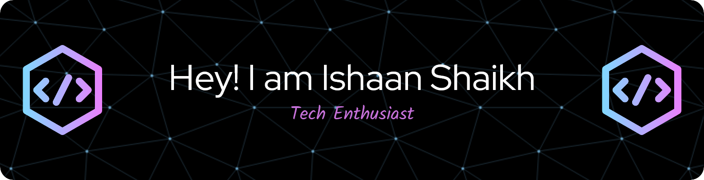

I'm a Computer Engineering student passionate about **Machine Learning, Computer Vision, and Open Source Development**. I enjoy exploring **cybersecurity** and **deep learning**, finding innovative ways to enhance security and intelligence in real-world applications.

I enjoy solving real-world problems with code, contributing to open-source projects, and continuously learning new technologies. Currently, I'm exploring **confidence calibration in pose estimation** and its impact on improving model reliability.  

---

## 👩‍💻 About Me
- Currently exploring **Deep Learning and Computer Vision**
- Enthusiastic about **problem solving**
- Passionate about **Open-source development**
- Enjoy participating in **CTFs, coding challenges, and tech events**  

---

## 🛠️ Languages & Tools  

### **Programming Languages**  

### **Libraries and Frameworks**  

 

### **Development & Tools**  

---

## 📈 GitHub Stats

&nbsp;&nbsp;&nbsp;

---

---
